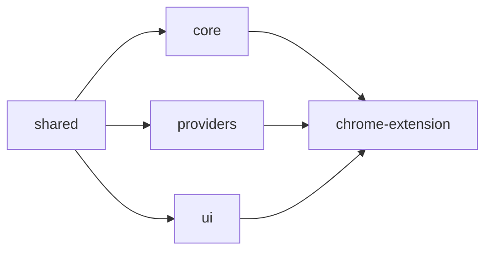
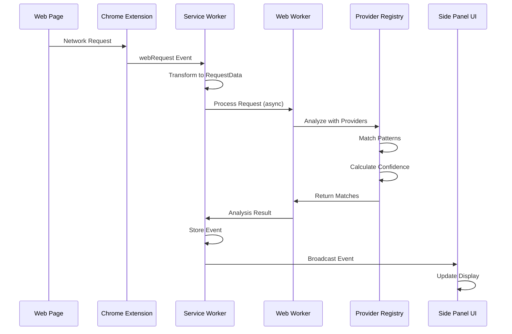

# PixelTracer Architecture

## 🏗️ System Overview

PixelTracer is built as a modern Chrome extension using a monorepo architecture with strict separation of concerns. The system is designed for high performance, extensibility, and maintainability.

```mermaid
graph TB
    subgraph "Chrome Browser"
        WP[Web Page]
        CE[Chrome Extension APIs]
    end
    
    subgraph "PixelTracer Extension"
        SW[Service Worker<br/>Background Script]
        SP[Side Panel UI]
        PU[Popup UI]
    end
    
    subgraph "Core Packages"
        SHARED[/@pixeltracer/shared]
        CORE[/@pixeltracer/core]
        PROVIDERS[/@pixeltracer/providers]
        UI[/@pixeltracer/ui]
    end
    
    WP -->|Network Requests| CE
    CE -->|webRequest API| SW
    SW -->|Process| CORE
    CORE -->|Analyze| PROVIDERS
    SW -->|Display| SP
    SP -->|Components| UI
    PU -->|Components| UI
    
    SHARED -->|Types| CORE
    SHARED -->|Types| PROVIDERS
    SHARED -->|Types| UI
```

## 📦 Package Architecture

### Monorepo Structure

```
pixeltracer/
├── apps/
│   └── chrome-extension/     # Chrome extension application
├── packages/
│   ├── shared/              # Shared types and utilities
│   ├── core/                # Core engine and processing
│   ├── providers/           # Tracking provider implementations
│   └── ui/                  # React UI components
├── docs/                    # Documentation
├── scripts/                 # Build and release scripts
└── .github/                 # GitHub Actions workflows
```

### Package Dependencies



## 🎯 Core Components

### 1. Service Worker (Background Script)

The service worker is the brain of the extension, handling:

- **Request Interception**: Captures all network requests via Chrome's webRequest API
- **Event Processing**: Routes requests through the analysis pipeline
- **State Management**: Maintains per-tab event storage
- **Message Routing**: Coordinates communication between extension parts

```typescript
// Simplified service worker flow
chrome.webRequest.onBeforeRequest.addListener(
  (details) => {
    const request = transformToRequestData(details);
    const analysis = await analyzeRequest(request);
    if (analysis.bestMatch) {
      storeEvent(details.tabId, analysis.bestMatch.event);
      notifyUI(details.tabId, analysis.bestMatch.event);
    }
  },
  { urls: ["<all_urls>"] }
);
```

### 2. Core Engine

The core engine provides the foundational systems:

#### Event Bus
- Pub/sub system for component communication
- Priority-based event queuing
- Batch processing capabilities

```typescript
class EventBus {
  on(event: string, handler: Function)
  emit(event: string, data: any)
  off(event: string, handler: Function)
}
```

#### Storage Engine
- Per-tab event storage
- Memory management with automatic cleanup
- Persistence layer for settings

#### Request Proxy
- Request transformation and normalization
- Provider matching orchestration
- Response caching

### 3. Provider System

Extensible provider architecture for tracking service support:

```typescript
abstract class BaseProvider {
  abstract canHandle(request: RequestData): Promise<number>
  abstract parse(request: RequestData): Promise<ProviderMatch>
  abstract enrichEvent(event: TrackingEvent): Promise<void>
  abstract groupParameters(params: Record<string, any>): ParameterGroup[]
}
```

Each provider implements:
- **Pattern Matching**: URL and request pattern detection
- **Parameter Parsing**: Extract meaningful data from requests
- **Confidence Scoring**: Determine match certainty
- **Business Context**: Add human-readable explanations

### 4. UI Components

React-based UI with shadcn/ui components:

#### Side Panel
- Main monitoring interface
- Real-time event dashboard
- Advanced filtering and search
- Export functionality

#### Popup
- Quick access controls
- Status indicators
- Basic statistics

## 🔄 Data Flow

### Request Processing Pipeline



### State Management

```typescript
// Per-tab state management
interface TabState {
  tabId: number
  events: TrackingEvent[]
  filters: FilterConfig
  settings: TabSettings
  stats: TabStatistics
}

// Global state
interface GlobalState {
  providers: ProviderRegistry
  settings: GlobalSettings
  performance: PerformanceMetrics
}
```

## ⚡ Performance Optimizations

### 1. Web Workers
- Offload heavy processing from main thread
- Parallel request analysis
- Non-blocking UI updates

### 2. Virtual Scrolling
- Render only visible events
- Support for 10,000+ events
- Smooth 60fps scrolling

### 3. Request Deduplication
- Cache analysis results
- Skip duplicate requests
- Configurable cache TTL

### 4. Memory Management
- Automatic event cleanup
- Configurable retention limits
- Memory usage monitoring

```typescript
class MemoryManager {
  maxEvents = 5000
  maxMemoryMB = 100
  cleanupThreshold = 0.9
  
  monitorMemory() {
    if (this.getUsage() > this.maxMemoryMB * this.cleanupThreshold) {
      this.performCleanup();
    }
  }
}
```

## 🔐 Security Architecture

### Content Security Policy
```json
{
  "content_security_policy": {
    "extension_pages": "script-src 'self'; object-src 'self'"
  }
}
```

### Permissions Model
- Minimal required permissions
- No host permissions by default
- User-controlled data access

### Data Privacy
- All processing happens locally
- No external data transmission
- No user tracking or analytics

## 🧩 Extension Points

### Adding New Providers

1. Extend `BaseProvider` class
2. Implement required methods
3. Register in provider registry
4. Add tests and documentation

```typescript
class MyProvider extends BaseProvider {
  constructor() {
    super({
      id: 'my-provider',
      name: 'My Tracking Service',
      patterns: {
        urlPatterns: ['*://track.myservice.com/*']
      }
    });
  }
  
  async canHandle(request: RequestData): Promise<number> {
    // Return confidence score 0.0 - 1.0
  }
  
  async parse(request: RequestData): Promise<ProviderMatch> {
    // Extract and return tracking data
  }
}
```

### Custom Filters

```typescript
interface CustomFilter {
  id: string
  name: string
  predicate: (event: TrackingEvent) => boolean
  priority: number
}
```

### UI Extensions

- Custom dashboard widgets
- Additional export formats
- Theme customization

## 🏭 Build System

### Development Build
```bash
pnpm dev        # Watch mode with HMR
pnpm build:dev  # Development build
```

### Production Build
```bash
pnpm build      # Optimized production build
pnpm package    # Create distributable ZIP
```

### Build Pipeline
1. TypeScript compilation
2. Vite bundling
3. Asset optimization
4. Manifest generation
5. Extension packaging

## 🔍 Testing Architecture

### Unit Tests
- Jest for unit testing
- 90%+ code coverage target
- Provider-specific test suites

### Integration Tests
- End-to-end extension testing
- Chrome extension test framework
- Automated UI testing

### Performance Tests
- Load testing with 1000+ events/second
- Memory leak detection
- Response time benchmarks

## 📊 Monitoring & Debugging

### Debug Mode
```typescript
// Enable debug logging
localStorage.setItem('PIXELTRACER_DEBUG', 'true');
```

### Performance Monitoring
- Built-in performance profiler
- Memory usage tracking
- Event processing metrics

### Error Handling
- Graceful degradation
- Error boundaries in UI
- Detailed error logging

## 🚀 Deployment Architecture

### Chrome Web Store
- Automated submission via CI/CD
- Staged rollout process
- Version management

### GitHub Releases
- Automated changelog generation
- Asset attachment
- Source code archives

### Update Mechanism
- Chrome's automatic updates
- Version compatibility checks
- Migration scripts

## 📈 Scalability Considerations

### Current Limits
- 10,000 events per tab
- 100MB memory budget
- 1000 events/second processing

### Future Scaling
- IndexedDB for large datasets
- Streaming processing
- Cloud sync capabilities
- Distributed processing

---

*This architecture document provides a comprehensive overview of PixelTracer's technical design. For specific implementation details, refer to the source code and inline documentation.*

*Last updated: August 2025*