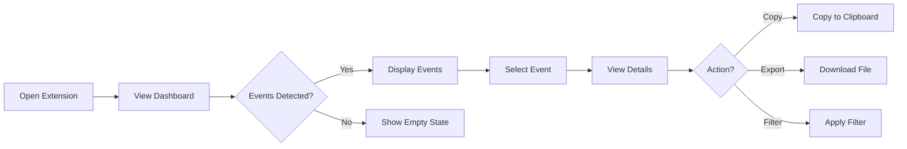
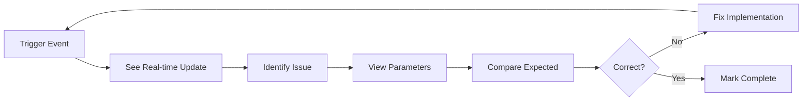

# PixelTracer UI/UX Design Guide

## 🎨 Design Philosophy

PixelTracer's design philosophy centers on clarity, efficiency, and developer ergonomics. We believe that powerful tools don't have to be complicated, and that good design makes complex data accessible.

### Core Principles

1. **Clarity Over Cleverness** - Information should be immediately understandable
2. **Performance is UX** - Fast response times are non-negotiable
3. **Progressive Disclosure** - Show essential info first, details on demand
4. **Consistency** - Predictable patterns across all interfaces
5. **Accessibility** - Usable by everyone, regardless of abilities

## 🎯 User Personas

### Primary Persona: Digital Marketing Developer
- **Name**: Alex Chen
- **Role**: Frontend Developer at Marketing Agency
- **Goals**: Quickly verify tracking implementations
- **Pain Points**: Switching between multiple debugging tools
- **Needs**: Real-time feedback, clear error messages

### Secondary Persona: Marketing Analyst
- **Name**: Sarah Johnson
- **Role**: Digital Marketing Analyst
- **Goals**: Validate campaign tracking
- **Pain Points**: Technical jargon, complex interfaces
- **Needs**: Business context, export capabilities

### Tertiary Persona: QA Engineer
- **Name**: Mike Rodriguez
- **Role**: QA Engineer at E-commerce Company
- **Goals**: Automated testing of tracking
- **Pain Points**: Manual verification processes
- **Needs**: Bulk operations, comparison tools

## 🎨 Visual Design System

### Color Palette

#### Light Theme
```css
--primary: #3B82F6        /* Blue - Primary actions */
--primary-hover: #2563EB  /* Blue - Hover state */
--success: #10B981        /* Green - Success states */
--warning: #F59E0B        /* Amber - Warnings */
--error: #EF4444          /* Red - Errors */
--background: #FFFFFF     /* White - Main background */
--surface: #F9FAFB        /* Light gray - Cards */
--text-primary: #111827   /* Dark gray - Primary text */
--text-secondary: #6B7280 /* Gray - Secondary text */
--border: #E5E7EB         /* Light gray - Borders */
```

#### Dark Theme
```css
--primary: #60A5FA        /* Light blue - Primary actions */
--primary-hover: #3B82F6  /* Blue - Hover state */
--success: #34D399        /* Light green - Success states */
--warning: #FBBF24        /* Light amber - Warnings */
--error: #F87171          /* Light red - Errors */
--background: #0F172A     /* Dark blue - Main background */
--surface: #1E293B        /* Dark gray - Cards */
--text-primary: #F1F5F9   /* Light gray - Primary text */
--text-secondary: #94A3B8 /* Gray - Secondary text */
--border: #334155         /* Dark gray - Borders */
```

### Typography

```css
/* Font Stack */
--font-sans: -apple-system, BlinkMacSystemFont, "Segoe UI", Roboto, 
             "Helvetica Neue", Arial, sans-serif;
--font-mono: "SF Mono", Monaco, "Cascadia Code", "Roboto Mono", 
             Consolas, monospace;

/* Type Scale */
--text-xs: 0.75rem;    /* 12px - Labels, captions */
--text-sm: 0.875rem;   /* 14px - Secondary text */
--text-base: 1rem;     /* 16px - Body text */
--text-lg: 1.125rem;   /* 18px - Subheadings */
--text-xl: 1.25rem;    /* 20px - Headings */
--text-2xl: 1.5rem;    /* 24px - Page titles */

/* Font Weights */
--font-normal: 400;
--font-medium: 500;
--font-semibold: 600;
--font-bold: 700;
```

### Spacing System

```css
/* 8-point grid system */
--space-1: 0.25rem;  /* 4px */
--space-2: 0.5rem;   /* 8px */
--space-3: 0.75rem;  /* 12px */
--space-4: 1rem;     /* 16px */
--space-5: 1.25rem;  /* 20px */
--space-6: 1.5rem;   /* 24px */
--space-8: 2rem;     /* 32px */
--space-10: 2.5rem;  /* 40px */
--space-12: 3rem;    /* 48px */
--space-16: 4rem;    /* 64px */
```

## 🖼️ Interface Components

### Event Card Design

```
┌─────────────────────────────────────────────────────────┐
│ [Icon] Provider Name          Event Type       HH:MM:SS │
│ ─────────────────────────────────────────────────────── │
│ Account ID: 123456789                                   │
│ URL: https://example.com/page                           │
│                                                          │
│ [▼ Parameters (12)]  [📋 Copy]  [↗ Export]             │
└─────────────────────────────────────────────────────────┘
```

### Dashboard Layout

```
┌──────────────────────────────────────────────────────────┐
│  PixelTracer  [📊 Stats] [⚙️ Settings] [❓ Help]         │
├──────────────────────────────────────────────────────────┤
│  [🔍 Search...]  [▼ Providers] [▼ Events] [▼ Time]      │
├──────────────────────────────────────────────────────────┤
│                                                           │
│  ┌─────────────┐  ┌─────────────┐  ┌─────────────┐     │
│  │ Total Events│  │  Providers  │  │   Errors    │     │
│  │    1,234    │  │      5      │  │      3      │     │
│  └─────────────┘  └─────────────┘  └─────────────┘     │
│                                                           │
│  Event Stream                                            │
│  ┌────────────────────────────────────────────────┐     │
│  │ [Event Card 1]                                 │     │
│  │ [Event Card 2]                                 │     │
│  │ [Event Card 3]                                 │     │
│  │ ...                                            │     │
│  └────────────────────────────────────────────────┘     │
└──────────────────────────────────────────────────────────┘
```

## 🔄 User Flows

### Primary Flow: Monitor Tracking Events



### Secondary Flow: Debug Implementation



## 🎯 Interaction Patterns

### Hover States
- **Cards**: Subtle shadow elevation
- **Buttons**: Darker background color
- **Links**: Underline decoration
- **Icons**: Tooltip with description

### Click Feedback
- **Immediate**: Visual response within 50ms
- **Loading**: Skeleton screens for async operations
- **Success**: Green checkmark animation
- **Error**: Red shake animation

### Keyboard Navigation
```
Tab         - Navigate through elements
Enter       - Activate selected element
Escape      - Close modals/dropdowns
/           - Focus search
Ctrl+K      - Command palette
Ctrl+E      - Export current view
Ctrl+C      - Copy selected event
Arrow Keys  - Navigate event list
```

## 📱 Responsive Design

### Breakpoints
```css
--mobile: 320px    /* Minimum supported */
--tablet: 768px    /* Side panel default */
--desktop: 1024px  /* Full dashboard */
--wide: 1440px     /* Large monitors */
```

### Adaptive Layouts
- **Mobile**: Stack elements vertically
- **Tablet**: 2-column grid
- **Desktop**: 3-column grid with sidebar
- **Wide**: Multi-panel dashboard

## ♿ Accessibility Guidelines

### WCAG 2.1 Compliance
- **Level AA**: Minimum target
- **Contrast Ratios**: 4.5:1 for normal text, 3:1 for large text
- **Focus Indicators**: Visible keyboard focus
- **Screen Readers**: Semantic HTML and ARIA labels

### Accessibility Features
```html
<!-- Semantic structure -->
<main role="main" aria-label="Event Dashboard">
  <section aria-label="Event List">
    <article aria-label="Tracking Event">
      <!-- Content -->
    </article>
  </section>
</main>

<!-- Keyboard shortcuts -->
<button aria-label="Export (Ctrl+E)" aria-keyshortcuts="Control+E">
  Export
</button>

<!-- Live regions for updates -->
<div aria-live="polite" aria-atomic="true">
  3 new events detected
</div>
```

## 🎭 Micro-interactions

### Loading States
```typescript
// Skeleton screens for content loading
<div className="animate-pulse">
  <div className="h-4 bg-gray-200 rounded w-3/4 mb-2"></div>
  <div className="h-4 bg-gray-200 rounded w-1/2"></div>
</div>
```

### Transitions
```css
/* Smooth transitions for state changes */
.event-card {
  transition: all 0.2s ease-in-out;
}

/* Spring animations for actions */
@keyframes success-bounce {
  0%, 100% { transform: scale(1); }
  50% { transform: scale(1.1); }
}
```

### Feedback Messages
- **Success**: "✓ Event copied to clipboard"
- **Error**: "⚠️ Failed to export data"
- **Info**: "ℹ️ 5 events filtered"
- **Loading**: "Loading events..."

## 🖌️ Icon System

### Provider Icons
- 16x16px base size
- PNG format with transparency
- Retina versions (@2x)
- Consistent visual weight

### UI Icons (Lucide React)
```typescript
import { 
  Search,      // Search functionality
  Filter,      // Filtering options
  Download,    // Export actions
  Copy,        // Copy to clipboard
  Settings,    // Configuration
  HelpCircle,  // Help/documentation
  AlertCircle, // Warnings
  CheckCircle, // Success states
  XCircle,     // Error states
  ChevronDown  // Expandable sections
} from 'lucide-react';
```

## 📊 Data Visualization

### Event Timeline
```
Time    │ 09:00 ─────── 10:00 ─────── 11:00 ─────── 12:00
Events  │   ▁▂▃▄▅▆▇█▇▆▅▄▃▂▁▂▃▄▅▆▇█▇▆▅▄▃▂▁
GA      │   ●───●─●●──●────●─●──●●─●───●──●─●
FB      │     ●──────●───●────●────●───●─────●
TikTok  │       ●────────●──────●────────●───
```

### Provider Distribution
```
Google Analytics  ████████████████████ 45%
Facebook Pixel    ████████████░░░░░░░░ 30%
TikTok Pixel      ████████░░░░░░░░░░░░ 20%
Other             ██░░░░░░░░░░░░░░░░░░  5%
```

## 🎨 Component Library

### Buttons
```tsx
// Primary button
<Button variant="primary" size="md">
  Track Events
</Button>

// Secondary button
<Button variant="secondary" size="sm">
  View Details
</Button>

// Icon button
<Button variant="ghost" size="icon">
  <Settings className="h-4 w-4" />
</Button>
```

### Cards
```tsx
<Card>
  <CardHeader>
    <CardTitle>Event Details</CardTitle>
    <CardDescription>Facebook Pixel Purchase Event</CardDescription>
  </CardHeader>
  <CardContent>
    {/* Event parameters */}
  </CardContent>
  <CardFooter>
    <Button>Export</Button>
  </CardFooter>
</Card>
```

### Forms
```tsx
<Form>
  <FormField>
    <FormLabel>Filter by Provider</FormLabel>
    <Select>
      <SelectTrigger>
        <SelectValue placeholder="All Providers" />
      </SelectTrigger>
      <SelectContent>
        <SelectItem value="ga">Google Analytics</SelectItem>
        <SelectItem value="fb">Facebook Pixel</SelectItem>
      </SelectContent>
    </Select>
  </FormField>
</Form>
```

## 🔮 Future Design Considerations

### Advanced Visualizations
- Real-time graphs and charts
- Heat maps for event density
- Network diagrams for request flow
- 3D visualization for complex data

### AI-Powered Features
- Smart suggestions for filters
- Anomaly highlighting
- Pattern recognition in events
- Predictive search

### Customization
- User-defined themes
- Customizable dashboard layouts
- Personalized shortcuts
- Saved view presets

---

*This design guide is a living document that evolves with user needs and design trends. All designs should prioritize usability, performance, and accessibility.*

*Last updated: August 2025*